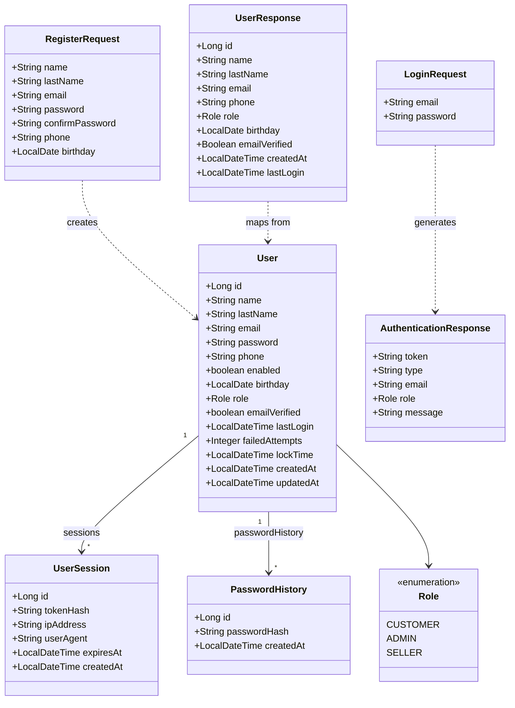
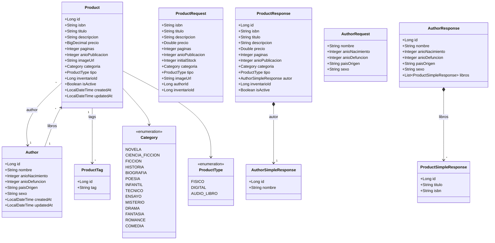
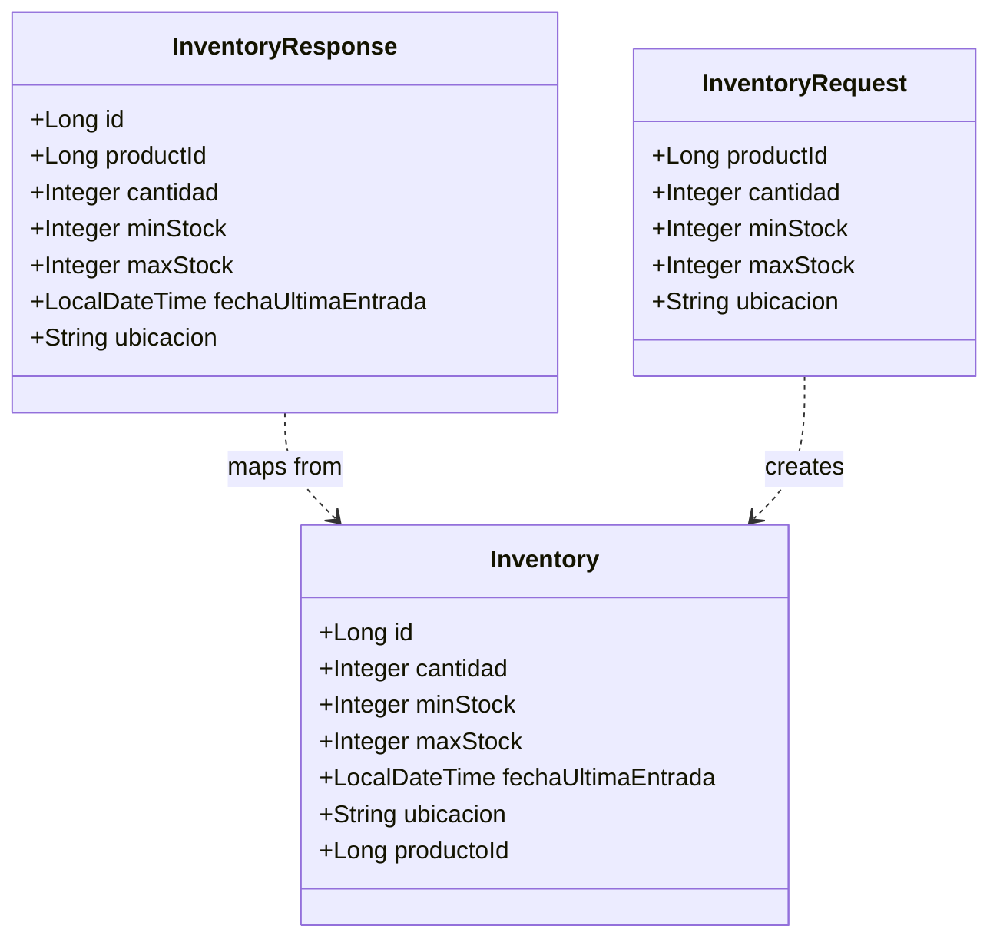
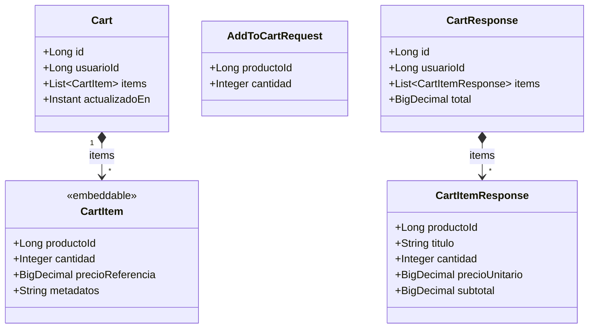
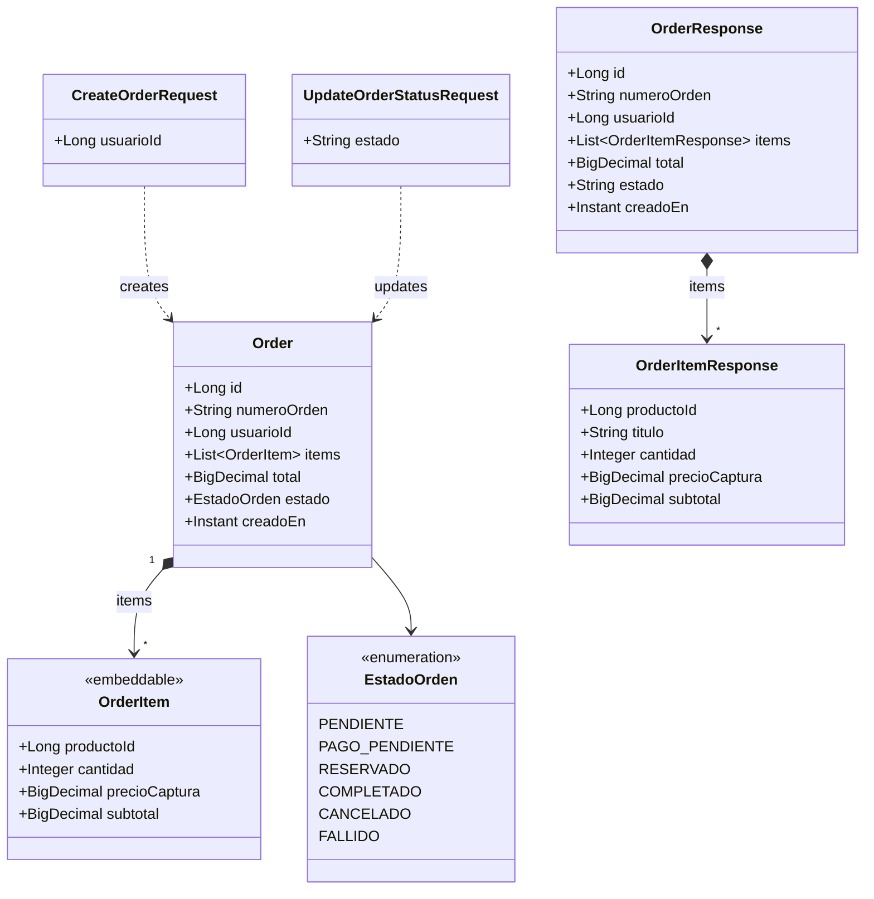
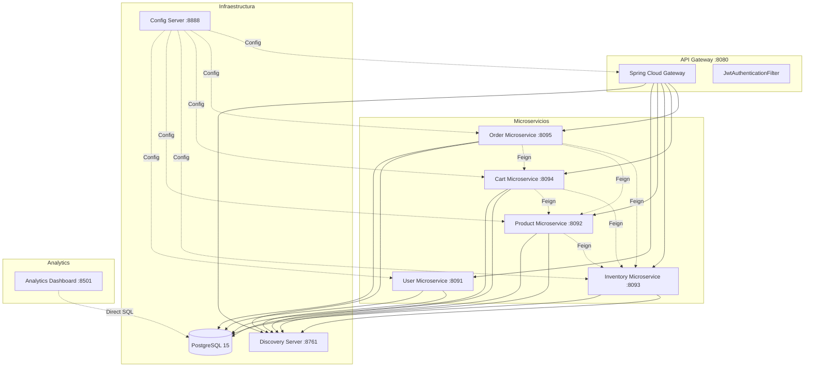
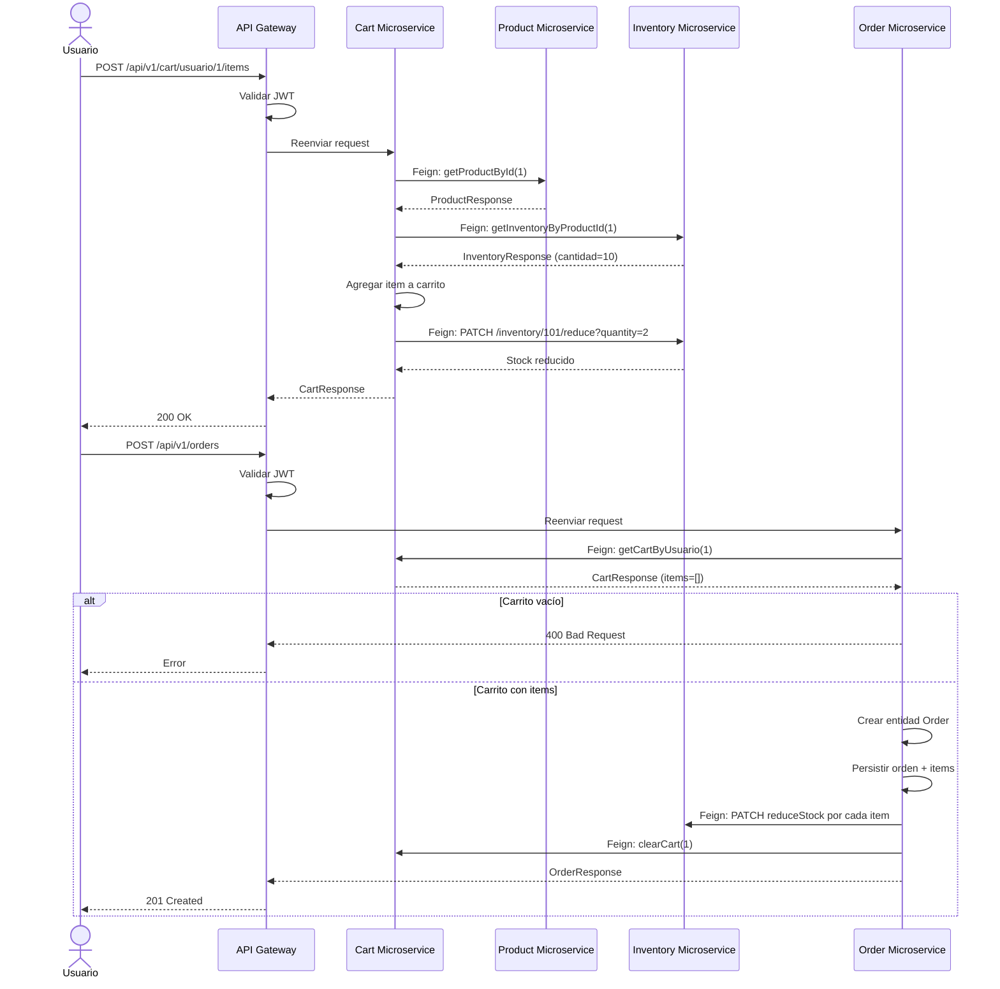
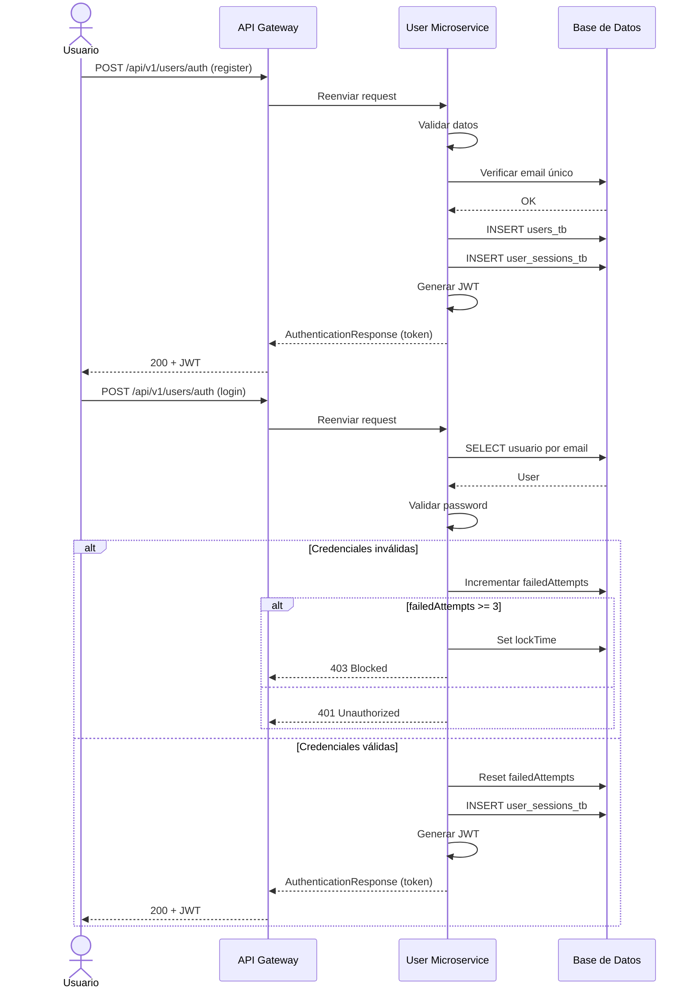
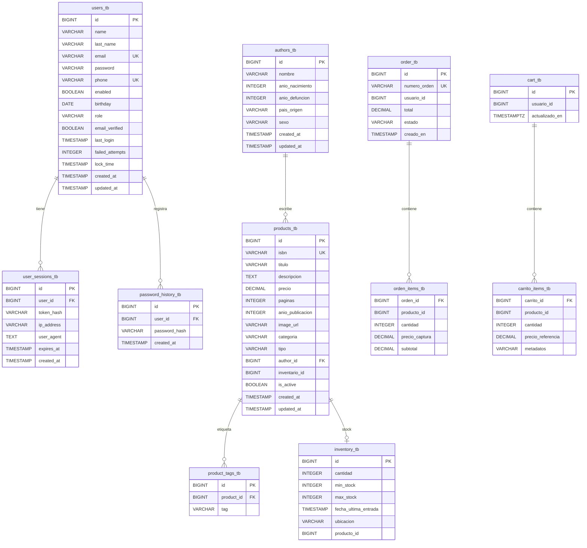

# Documentación Técnica - Microservicios Librería

## Diagrama de Clases UML

### 1. User Microservice

### 2. Product Microservice

### 3. Inventory Microservice

### 4. Cart Microservice

### 5. Order Microservice

## Diagrama de Componentes

## Diagrama de Secuencia - Creación de Pedido

## Diagrama de Secuencia - Autenticación

## Modelo de Datos Relacional

## Endpoints de la API

### User Microservice (`/api/v1/users`)

| Método | Ruta | Descripción | Auth |
|--------|------|-------------|------|
| POST | `/auth` | Registrar o iniciar sesión | No |
| GET | `/me` | Perfil del usuario autenticado | JWT |
| PATCH | `/me/password` | Cambiar contraseña | JWT |
| GET | `/me/sessions` | Listar sesiones activas | JWT |
| DELETE | `/me/sessions/{id}` | Cerrar sesión específica | JWT |

### Product Microservice (`/api/v1/products`)

| Método | Ruta | Descripción | Auth |
|--------|------|-------------|------|
| GET | `/` | Listar productos (paginado) | JWT |
| GET | `/{id}` | Obtener producto por ID | JWT |
| POST | `/` | Crear producto | JWT |
| PUT | `/{id}` | Actualizar producto | JWT |
| DELETE | `/{id}` | Eliminar producto | JWT |
| GET | `/authors` | Listar autores | JWT |
| GET | `/authors/{id}` | Obtener autor por ID | JWT |
| POST | `/authors` | Crear autor | JWT |
| PUT | `/authors/{id}` | Actualizar autor | JWT |
| DELETE | `/authors/{id}` | Eliminar autor | JWT |

### Inventory Microservice (`/api/v1/inventory`)

| Método | Ruta | Descripción | Auth |
|--------|------|-------------|------|
| GET | `/` | Listar todo el inventario | JWT |
| GET | `/{id}` | Obtener inventario por ID | JWT |
| GET | `/product/{productId}` | Obtener inventario por producto | JWT |
| POST | `/` | Crear registro de inventario | JWT |
| PUT | `/{id}` | Actualizar inventario | JWT |
| DELETE | `/{id}` | Eliminar inventario | JWT |
| PATCH | `/{id}/reduce?quantity=n` | Reducir stock | JWT |
| PATCH | `/{id}/add?quantity=n` | Aumentar stock | JWT |

### Cart Microservice (`/api/v1/cart`)

| Método | Ruta | Descripción | Auth |
|--------|------|-------------|------|
| GET | `/usuario/{usuarioId}` | Obtener carrito del usuario | JWT |
| POST | `/usuario/{usuarioId}/items` | Agregar producto al carrito | JWT |
| DELETE | `/usuario/{usuarioId}` | Vaciar carrito | JWT |
| DELETE | `/usuario/{usuarioId}/items/{productoId}` | Eliminar item del carrito | JWT |

### Order Microservice (`/api/v1/orders`)

| Método | Ruta | Descripción | Auth |
|--------|------|-------------|------|
| POST | `/` | Crear orden desde el carrito | JWT |
| GET | `/` | Listar todas las órdenes (admin) | JWT |
| GET | `/{id}` | Obtener orden por ID | JWT |
| GET | `/numero/{numeroOrden}` | Obtener orden por UUID | JWT |
| GET | `/usuario/{usuarioId}` | Órdenes del usuario (paginado) | JWT |
| PATCH | `/{id}/estado` | Actualizar estado de orden | JWT |
| DELETE | `/{id}` | Cancelar orden (restaura stock) | JWT |

## Comunicación entre Servicios (Feign)

| Origen | Destino | Método | Endpoint |
|--------|---------|--------|----------|
| Product Microservice | Inventory Microservice | GET | `/api/v1/inventory/product/{productId}` |
| Cart Microservice | Product Microservice | GET | `/api/v1/products/{id}` |
| Cart Microservice | Inventory Microservice | GET | `/api/v1/inventory/product/{productId}` |
| Cart Microservice | Inventory Microservice | PATCH | `/api/v1/inventory/{id}/reduce` |
| Order Microservice | Cart Microservice | GET | `/api/v1/cart/usuario/{usuarioId}` |
| Order Microservice | Cart Microservice | DELETE | `/api/v1/cart/usuario/{usuarioId}` |
| Order Microservice | Product Microservice | GET | `/api/v1/products/{id}` |
| Order Microservice | Inventory Microservice | PATCH | `/api/v1/inventory/{id}/reduce` |
| Order Microservice | Inventory Microservice | PATCH | `/api/v1/inventory/{id}/add` |

## Migraciones Flyway

| Microservicio | Migraciones | Descripción |
|--------------|-------------|-------------|
| user-microservice | V1, V2 | Tablas de usuarios, sesiones, historial; fix tipo ip_address |
| product-microservice | V1, V2 | Tablas de productos, autores, tags; datos de prueba (15 libros) |
| inventory-microservice | V1, V2 | Tabla de inventario; datos de prueba (15 registros) |
| cart-microservice | V1 | Tablas de carrito e items |
| order-microservice | V1 | Tablas de órdenes e items |

## Puertos y Dependencias

| Servicio | Puerto | Depende de |
|----------|--------|------------|
| postgres | 5432 | - |
| config-server | 8888 | postgres |
| discovery-server | 8761 | config-server |
| user-microservice | 8091 | config-server, discovery-server, postgres |
| product-microservice | 8092 | config-server, discovery-server, postgres |
| inventory-microservice | 8093 | config-server, discovery-server, postgres |
| cart-microservice | 8094 | config-server, discovery-server, postgres, product, inventory |
| order-microservice | 8095 | config-server, discovery-server, postgres, cart, product, inventory |
| api-gateway | 8080 | config-server, discovery-server, todos los microservicios |
| analytics-dashboard | 8501 | postgres |

## Issues Conocidos

| # | Descripción | Severidad |
|---|-------------|-----------|
| 1 | Gateway sin autenticación (`permitAll()`) | Alta |
| 2 | JWT secret hardcodeado y débil | Alta |
| 3 | Passwords de BD hardcodeadas en config-server | Alta |
| 4 | Race condition en `CartServiceImpl.addProductToCart()` | Media |
| 5 | Race condition en `UserServiceImpl.login()` | Media |
| 6 | `@Scheduled` faltante para desbloquear cuentas | Media |
| 7 | `creadoEn` null en response de Order (falta `@CreationTimestamp`) | Baja |
| 8 | `@Builder` ignora field initializers (`numeroOrden`) | Baja |
| 9 | CORS hardcodeado a `http://localhost:3000` (frontend corre en :5173) | Baja |
| 10 | ~~Nombre de carpeta mal escrito: `analitycs-dashboard`~~ | **CORREGIDO** |
